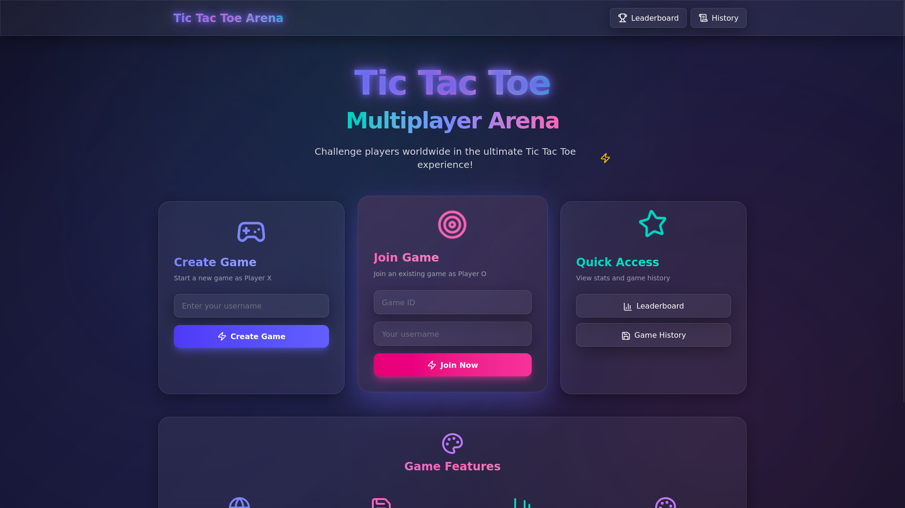

<div align="center">

# Tic Tac Toe Arena

Next.js multiplayer Tic Tac Toe experience with a neon-glass UI, persistent stats, and server-driven gameplay.

</div>

<p align="center">
  
  
  
  
  
  
  
</p>

## Overview

Tic Tac Toe Arena is a full-stack two-player experience powered by Next.js 15 App Router, TypeScript, and MongoDB Atlas via Mongoose. Players join with lightweight usernames (no auth friction), create or join games, and see their stats update instantly across Leaderboard, History, and Replay routes. The UI leans on Tailwind CSS animations, Lucide icons, and glassmorphism to deliver an arcade-inspired look.

## Feature Highlights

- ⚡ **One-click matchmaking** – Create a room as Player X or join with a game ID as Player O.
- 🧠 **Server-side game orchestration** – Moves, winners, and draws are persisted in MongoDB for reliable replays.
- 🏆 **Leaderboard + History** – Track wins/losses/draws, browse past matches, and replay move-by-move timelines.
- 🖥️ **Multi-render strategy** – Mix of SSG, CSR, SSR, and ISR routes to balance interactivity and performance.
- 🎨 **Modern UI polish** – Animated cards, neon gradients, and Lucide iconography for buttons/cards/feature callouts.
- 🔐 **Username-only entry** – Barrier-free onboarding using simple username registration stored in MongoDB.

## UI Preview

> New dashboard view placed in `/public/` — live demo at [tictecme.vercel.app](https://tictecme.vercel.app/)

[](https://tictecme.vercel.app/)

## Folder Structure

```
Tic-tecGame/
└── tictactoe-app/
    ├── public/
    │   └── dashboard.png              # Landing screen showcase
    ├── src/
    │   ├── app/
    │   │   ├── api/
    │   │   │   ├── games/
    │   │   │   │   ├── route.ts       # Create game
    │   │   │   │   └── [gameId]/...
    │   │   │   └── players/route.ts   # Leaderboard data
    │   │   ├── game/[gameId]/page.tsx # CSR gameplay loop
    │   │   ├── history/...            # Replay + player history
    │   │   ├── leaderboard/page.tsx   # SSR leaderboard
    │   │   ├── page.tsx               # Landing page + actions
    │   │   └── layout.tsx             # Shell, header, metadata
    │   ├── lib/
    │   │   ├── db.ts                  # Mongoose connection cache
    │   │   └── game.ts                # Board helpers & winner logic
    │   └── models/
    │       ├── Game.ts
    │       └── Player.ts
    ├── .env.local.example (create)    # Mongo URI + app name
    └── package.json
```

## Tech Stack (Deep Dive)

| Layer | Details |
| --- | --- |
| Framework | Next.js 15 App Router, server actions, metadata per route |
| Language | TypeScript (strict) |
| Styling | Tailwind CSS 4, glassmorphism components, Lucide icons |
| Data | MongoDB Atlas with Mongoose ODM |
| Hosting | Ready for Vercel or any Node 18+ environment |

## Getting Started

1. **Install dependencies**
   ```bash
   cd tictactoe-app
   npm install
   ```
2. **Configure environment** – create `tictactoe-app/.env.local`:
   ```bash
   MONGODB_URI=ADD_YOUR_MONGO_ATLAS_URL
   NEXT_PUBLIC_APP_NAME=Tic Tac Toe Arena
   ```
3. **Run locally**
   ```bash
   npm run dev
   # open http://localhost:3000
   ```
4. **Production build**
   ```bash
   npm run build
   npm start
   ```

## Core Routes & Rendering Modes

| Route | Purpose | Rendering |
| --- | --- | --- |
| `/` | Landing page, create/join actions, feature cards | **SSG** |
| `/game/[gameId]` | Client-side gameplay, move polling, winner display | **CSR** |
| `/leaderboard` | Rank players by wins | **SSR** |
| `/history` | Player list with incremental refresh | **ISR (30s)** |
| `/history/[gameId]` | Replay move timeline | **Server (dynamic)** |
| `/history/user/[playerId]` | Player-focused match history | **Server (dynamic)** |

## API Endpoints

- `POST /api/games` – Create a new game with `{ player1Username }` → returns `{ _id }`.
- `POST /api/games/[gameId]/join` – Join an open match with `{ player2Username }`.
- `POST /api/games/[gameId]/move` – Persist a move `{ playerUsername, position }`.
- `GET /api/games/[gameId]` – Fetch a game with moves for rendering/replay.
- `GET /api/games/open` – List joinable rooms.
- `GET/POST /api/players` – Maintain leaderboard data.
- `GET /api/history/[playerId]` – Aggregate a player’s games + moves.

## Gameplay Flow

1. **Create Game** – Enter username on `/`, server action hits `POST /api/games`, redirects to `/game/[gameId]` as Player X.
2. **Share ID** – Friend submits Game ID + username to join as Player O.
3. **Make Moves** – Board alternates automatically (`nextSymbolFromMoves`). Winner/draw detection handled in `src/lib/game.ts`.
4. **Persist Stats** – Player documents update wins/losses/draws; history entries become available instantly.
5. **Explore Data** – Leaderboard, History, and Replay pages show real-time progress.

## Troubleshooting & Tips

- **Mongo connection errors** – Ensure `MONGODB_URI` is present and Atlas IP access rules allow your environment.
- **Absolute fetch origin** – Server actions derive origin via `headers().get('origin')`; adjust fallback for custom hosts.
- **Styling tweaks** – Tailwind classes live in `src/app/globals.css` + component files; neon glow utilities defined there.

Enjoy the game and customize the arena to match your brand!
